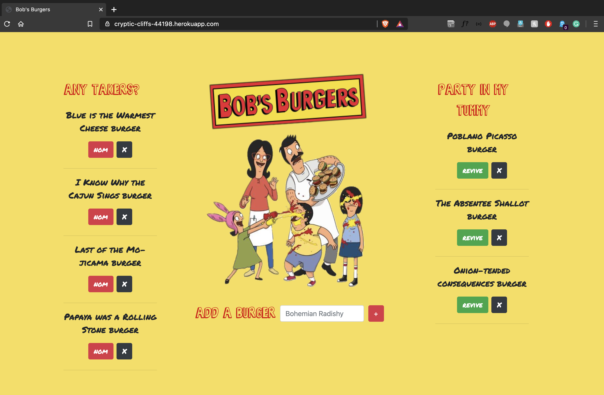

# **Bob's Burgers**

Burger logger built with MySQL, Node, Express, Handlebars and a homemade ORM and deployed on Heroku.

## Tech
* Node.js
* Express.js
* mysql
* handlebars

## Process
1. Set up database - create `burgers` table
2. Create `connection.js` file - setup the code to connect Node to MySQL. export connection.
3. Create an `orm.js` file, import connection
4. `orm.js` file - create the CRUD methods that will execute mysql commands. export orm.
5. `burgers_controller.js` file - import express and orm, create `router` and export `router`
6. Create routes - get/post/put/delete and set up logic within those routes
7. Create `views` folder
    + Create `index.handlebars`, set up template to render results to
    + Create `partials` folder for buttons to update/ delete burgers
    + Create `layouts` folder
    + Create `main.handlebars` within the `layouts` folder
    + Set up html page in `main.handlebars` and insert handlebars syntax {{{body}}} within body
8. Update css/ img/ fonts
9. Set up JawsDB Remote Database, add table
10. Deploy to Heroku

## Deployed
[Link - deployed on Heroku](https://cryptic-cliffs-44198.herokuapp.com/)

## Screenshots 
